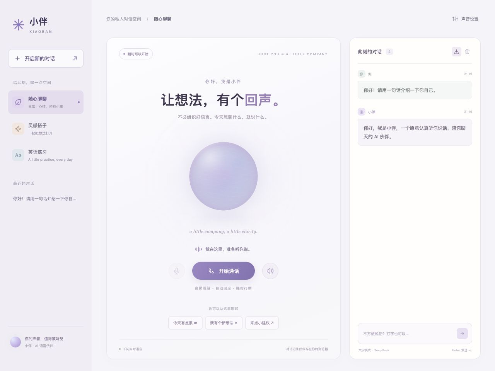
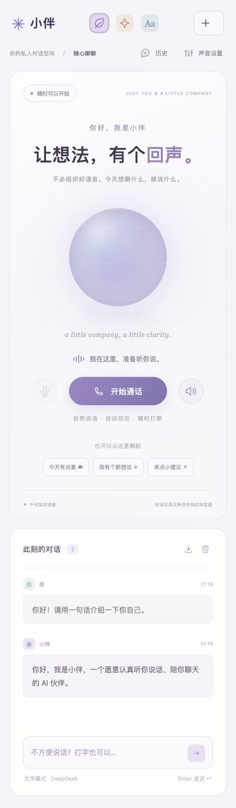

# 小伴 Xiaoban

像打电话一样和 AI 聊天：打开浏览器，点一下「开始通话」，直接开口说，它用声音回答，你可以接着聊、随时打断。小伴可以自己运行，适合聊日常、梳理想法或练英语口语。

**[在线体验](https://xiaoban-voice.gemigo.app)** · [English](README.en.md) · [MIT License](LICENSE)



## 能做什么

- 千问 Qwen 3.8 Omni Flash Realtime 原生语音对话，自动检测停顿，显示对话转录。
- 日常陪伴、想法讨论、英语练习三种提示词模式。英语练习是对话，不提供发音评分。
- 默认「流畅优先」：当前回复收齐后连续播放，减少分片网络抖动造成的停顿。可切换边收边播的低延迟模式。
- 打断、麦克风静音、扬声器开关，音色、语速与停顿设置。
- 可选 DeepSeek / OpenAI 兼容接口文字聊天，流式显示文字；文字模式不自动朗读。
- 桌面和手机布局，当前浏览器保存历史，可导出或清空对话。

这是早期版本。流畅优先需要等整段语音生成完才出声；低延迟模式在网络很差时仍会断续。回声消除和自动打断受麦克风、扬声器及浏览器影响，建议戴耳机。欢迎提交真实设备上的问题。

## 本地运行

需要 Node.js 22+、npm，以及已开通对应实时模型的[百炼 / Model Studio](https://help.aliyun.com/zh/model-studio/realtime)账户。本地版不需要 GemiGo 账号，模型调用使用你自己的 Key，并按提供商规则计费。

```sh
git clone https://github.com/Peiiii/xiaoban.git
cd xiaoban
npm ci
cp .env.example .env
```

在 `.env` 填写 `DASHSCOPE_API_KEY`，把 `DASHSCOPE_REALTIME_URL` 中的 `YOUR_WORKSPACE_ID` 替换成自己的业务空间 ID。API Key、业务空间和 endpoint 地域要匹配：

```dotenv
DASHSCOPE_API_KEY=your_api_key
DASHSCOPE_MODEL=qwen3.8-omni-flash-realtime
DASHSCOPE_REALTIME_URL=wss://YOUR_WORKSPACE_ID.cn-beijing.maas.aliyuncs.com/api-ws/v1/realtime
```

新加坡账户使用 `YOUR_WORKSPACE_ID.ap-southeast-1.maas.aliyuncs.com`。Qwen 3.8 使用业务空间专属域名；具体配置以[官方接入说明](https://help.aliyun.com/zh/model-studio/omni-realtime-python-sdk)为准。未开通模型、Key 不匹配或仍保留占位域名会导致连接失败。

```sh
npm start
```

打开 **http://localhost:4318**，点击「开始通话」，允许麦克风，直接说话。说完停顿后等待回应；说话或点击「打断回复」可中断，点击「结束通话」释放麦克风。

文字聊天独立配置，可选：

```dotenv
DEEPSEEK_API_KEY=your_text_api_key
DEEPSEEK_BASE_URL=https://api.deepseek.com/v1
DEEPSEEK_MODEL=deepseek-flash
```

也可以设置兼容 OpenAI `chat/completions` 的服务端地址、Key 和模型。它只替换文字模型，语音仍使用千问实时协议。修改 `.env` 后重启服务。

## 在线体验与部署

[在线小伴](https://xiaoban-voice.gemigo.app)使用 GemiGo 托管静态页面，通过平台代理访问模型，需要登录且有用量限制。线上模型 Key 由应用管理员配置在 Secrets 中。

本地 Node 服务默认仅监听 `127.0.0.1`，没有公网账号和限额系统。直接将它暴露到公网需要另外实现鉴权与用量控制。`npm run build` 生成静态页面；单独上传这些页面不会提供 Node 语音桥接。

如果使用自己的 GemiGo 应用及 API Connections，可构建平台版本：

```sh
GEMIGO_PROJECT_ID=your_project_id GEMIGO_APP_ID=your_app_id npm run build
```

平台需配置 `voice`、`text` 连接和应用访问规则。SDK 0.3.1 固定从官方 `docs.gemigo.io` 下载；生成的 SDK 文件不入库。本地模式同样安装该依赖，但不会要求平台登录。

## 数据与开发

API Key 只由服务端读取环境变量，不进入页面或聊天记录。浏览器中的历史保存于 localStorage，使用共享设备时可以清空。语音和语音转录由千问处理，文字模式对话由配置的文字提供商处理；本地服务不保存录音。开源代码不意味着模型服务离线运行。

```sh
npm run check
npm test
npm run build
```

测试覆盖 PCM 编解码、音频排程与取消、WS 桥接、配置边界、静态服务和平台模式登录恢复。浏览器装配测试 `tests/fixture-server.mjs` 使用合成蜂鸣音，仅用于开发测试；普通使用入口是 4318。`tests/browser-playback.mjs` 使用离线渲染，不向扬声器输出测试音。

代码结构及播放策略见 [架构说明](docs/architecture.md)。发现问题可在 [Issues](https://github.com/Peiiii/xiaoban/issues) 记录浏览器、设备、模式和复现步骤，请不要粘贴 Key 或登录凭据。如果这个小项目对你有用，欢迎点个 star。



## 许可

应用代码使用 [MIT](LICENSE)。第三方依赖及模型服务保留各自的许可和条款，见 [NOTICE](NOTICE)。
